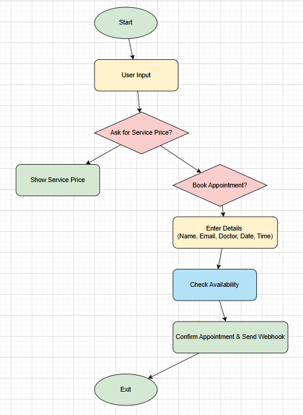

# Dental Care

This is a Python-based chatbot that helps users inquire about dental services, check prices, and book appointments with available doctors. 
The chatbot integrates with OpenAI's GPT-4 for additional assistance and uses Make.com webhooks to send booking details.  

---

## Features  

✅ Check dental service prices

✅ List available dental services  

✅ Book an appointment with a doctor  

✅ Validate email input before booking  

✅ Suggest available time slots if a chosen slot is unavailable  

✅ Integrate with Make.com webhook to send appointment details  

---

## Technologies Used

- **Python**  

- **OpenAI API (GPT-4)**  

- **pandas**  

- **requests**  

- **datetime**  

- **re (Regex)**  

- **difflib** 

## Setup
1. Clone the repository or download the files
- Clone project from [GitHub](https://github.com/Nadiia-developer/workUa.git)
- git clone https://github.com/Nadiia-developer/dentalCare.git
2. Create a virtual environment
- python -m venv venv
- On Mac: source venv/bin/activate 
- On Windows: venv\Scripts\activate
3. Install dependencies:
```bash 
pip install -r requirements.txt
```

### Set up your OpenAI API key
4. Open `main.py` and replace `"API_KEY"` with your actual OpenAI API key. 

### Webhook Integration
This chatbot integrates with a **Make.com** to send booking details once an appointment is successfully booked. The details sent include the patient's name, email, selected service, doctor's name, date, and time.

### Steps to Update Webhook URL:
5. Update the URL: Replace the current URL with your own webhook URL provided by Make.com.
For example:

   ```python
   webhook_url = "https://hook.eu2.make.com/your-webhook-url"

---


### Run the Chatbot
6. Run the chatbot script:   

   ```python
   python main.py

### 6. Isnteract with the Chatbot  

- **Type a dental service**: Enter the name of a dental service (e.g., "Teeth Whitening") to get its price.

- **List available dental services** Type `"list services"` to see a list of all available dental services.

- **Type "book appointment"**: Type `"book appointment"` to schedule a visit.

- **Exit the chatbot** Type `"exit"` to close the chatbot.

After entering the required details, the chatbot will confirm your appointment and provide a response.

---



